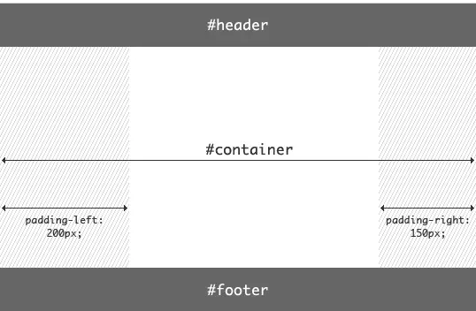
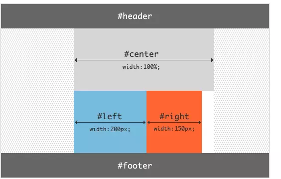
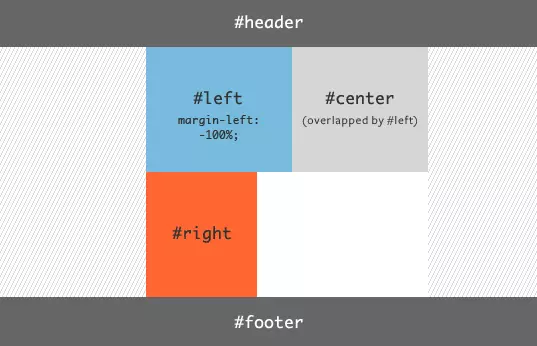
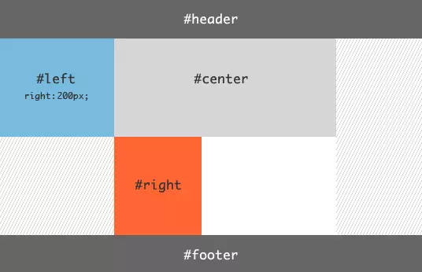
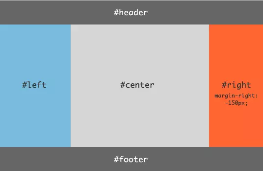

# 圣杯布局和双飞翼布局

都是两边固定宽度，中间自适应的三栏布局。都有用到`float: left`

主要的不同之处就是在解决中间部分被挡住的问题时，采取的解决办法不一样：圣杯布局是在父元素上设置了padding-left和padding-right，在给左右两边的内容设置position为relative，通过左移和右移来使得左右两边的内容得以很好的展现；而双飞翼则是在center这个div中再加了一个div来放置内容，在给这个新的div设置margin-left和margin-right 。

## 圣杯布局

```html
<body>
    <div class="header">header</div>
    <div class="container">
        <div class="center">center</div>
        <div class="left">left</div>
        <div class="right">right</div>
    </div>
    <div class="footer">footer</div>
</body>
```

```css
.header {
    height: 50px;
    background: #666;
    text-align: center;
}
.container {
    /* 左右栏通过添加负的margin放到正确的位置了，此段代码是为了摆正中间栏的位置 */
    padding: 0 200px 0 150px;
    height: 100px;
}
.center {
    float: left;
    width: 100%; /* 左栏上去到第一行 */
    height: 400px;
    background: skyblue;
}
.left,
.right {
    height: 400px;
    background: pink;
    float: left;
    position: relative;
}
.left {
    width: 150px;
    margin-left: -100%;
    /* 中间栏的位置摆正之后，左栏的位置也相应右移，通过相对定位的left恢复到正确位置 */
    left: -150px;
}
.right {
    width: 200px;
    margin-left: -200px;
    /* 中间栏的位置摆正之后，右栏的位置也相应左移，通过相对定位的right恢复到正确位置 */
    right: -200px;
}
.footer {
    height: 50px;
    background: #666;
    text-align: center;
}
```

> 这三个盒子全都脱离了文档流，那么让左右盒子“爬升”至上一行，需要用到负margin；
>
> 相对定位的目的是把左右两盒子移动到父盒子的padding里。

|  |  |
| ----------------------------------- | ----------------------------------- |
|  |  |
|  |                                     |

## 双飞翼布局——淘宝UED

```html
<body>
    <div class="header">header</div> 
    <div class="middle">
    	<div class="inside">middle</div>
    </div>
    <div class="left">left</div>
    <div class="right">right</div>
    <div class="footer">footer</div>
</body>
```

```css
.header {
    height: 50px;
    background: #666;
    text-align: center;
}
.middle {
    float: left;
    width: 100%; /* 左栏上去到第一行 */     
    height: 400px;
    background: skyblue;
}
.left,
.right {
    float: left;
    height: 400px;
    background: pink;
}
.left {
    width: 150px;
    margin-left: -100%; /* 相对于父元素宽度 */
}
.right {
    width: 200px;
    margin-left: -200px;
}
/* 给内部div添加margin，把内容放到中间栏，其实整个背景还是100% */
.inside {
    margin: 0 200px 0 150px;
    height: 400px;
}
.footer {
   clear: both; /* 记得清楚浮动 */
   height: 50px;
   background: #666;
   text-align: center;
}
```

## 三栏布局的其他实现

- Flex布局

  ```html
  <body>
      <header>...</header>
      <div class="content">
          <main>...</main>
          <nav>...</nav>
          <aside>...</aside>
      </div>
      <footer>...</footer>
  </body>
  ```

  ```css
  body {
      display: flex;
      min-height: 100vh;
      flex-direction: column;
  }
  header,
  footer {
      flex: 1;
  }
  .content {
      display: flex;
      flex: 1;
  }
  main {
      flex: 1;
  }
  nav, aside {
      /* 两个边栏的宽度设为12em */
      flex: 0 0 12em;
  }
  nav {
      /* 导航放到最左边 */
      order: -1;
  }
  ```

- 绝对定位布局

- table-cell布局

- 网格布局——grid

## 总结

1. 圣杯布局、双飞翼布局、flex布局的高度取决于内容区(center部分)，页面的高度取决于内容区；
2. 绝对定位的内容区高度取决于两边栏的最高点；
3. table-cell布局能让三栏的高度一致，但不能优先渲染 center；
4. 网格布局极其强大，但兼容性差。