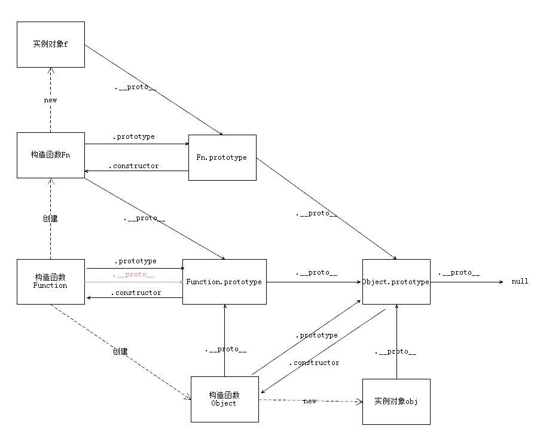

# 原型与原型链

> 原型：每个函数都有` .prototype` 属性，该属性指向原型对象；使用原型对象的好处是所有实例对象共享它所包含的属性和方法。
>
> 原型链：主要解决了继承的问题；每个对象都拥有一个原型对象，通过`.__proto__` 指针指向其原型对象，并从中继承方法和属性，同时原型对象也可能拥有原型，这样一层一层，最终指向 null



> 万物皆对象

### 什么是prototype

满分回答：JavaScript里面都是对象，必须有一种机制，将所有对象联系起来。 所以，Brendan Eich（布兰登·艾奇）最后还是设计了"继承"。 但是，他不打算引入"类"（class）的概念，因为一旦有了"类"， Javascript就是一种完整的面向对象编程语言了，这好像有点太正式了， 而且增加了初学者的入门难度。考虑到这一点， Brendan Eich决定为构造函数设置一个prototype属性。

> 布兰登·艾奇，1961年生于美国加州。1995年任职于网景期间，为网景浏览器开发出JavaScript，之后成为浏览器上应用最广泛的脚本语言之一。1998年布兰登协助成立mozilla，2003年在美国在线决定结束网景浏览器的开发后，布兰登协助成立了Mozilla基金会。

### 基本类型

string、number、boolean、undefined、null

基本类型的访问是按值访问的

### 引用类型

object、Array、RegExp、Date、Function

特殊的基本包装类型(String、Number、Boolean)

以及单体内置对象(Global、Math)

引用类型变量的值是一个指针，指向**堆内存**中的实际对象

```javascript
console.log(typeof 1);                  // number
console.log(typeof 'a');                // string
console.log(typeof true);               // boolean
console.log(typeof undefined);          // undefined
console.log(typeof function fn(){});    // function
console.log(typeof {});                 // object
console.log(typeof null);               // object
console.log(typeof []);                 // object
```

> typeof 对于基本类型，除了 null 都可以显示正确的类型；对于对象，除了函数都会显示 object

### js中的堆内存与栈内存

在js引擎中对变量的存储主要有两种位置，**堆内存和栈内存**。

和java中对内存的处理类似，**栈内存**主要用于存储各种**基本类型的**变量，包括Boolean、Number、String、Undefined、Null，**以及对象变量的指针，这时候栈内存给人的感觉就像一个线性排列的空间，每个小单元大小基本相等。

而堆内存主要负责像对象Object这种变量类型的存储。