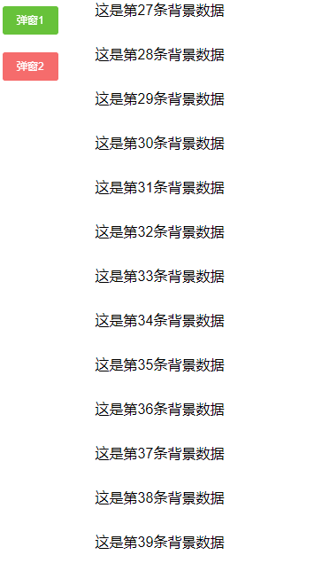

# vue 弹窗屏蔽滑动的两种解决方案

### 解决方案

两种解决方案，针对两种不同情况：

1. 弹框数据少，无需滑动
2. 弹框内数据需要滑动展示

#### 1. 无需滑动弹窗

##### a. 思路

> vue自带修饰符可解决该问题—— `@touchmove.prevent`

此方案重点在将`@touchmove.prevent`绑定到弹窗模块，然后动态控制弹窗显示隐藏即可。

##### b. 效果


##### c. 代码

```vue
<template>
    <div class="modalTest">
        <!-- 按钮组 -->
        <div class="btn">
            <el-button type="success" size="small" @click="modalSign1 = true">弹窗1</el-button>
        </div>

        <!-- 背景数据 -->
        <div class="listBG">
            <ul>
                <li v-for="item in 50">这是第{{ item }}条背景数据</li>
            </ul>
        </div>

        <!-- 弹框1 -->
        <div
             class="modalBox"
             v-if="modalSign1"
             @touchmove.prevent
             @click.self="modalSign1 = false">
            <div class="modal">
                <ul>
                    <li v-for="item in 8">这是第{{ item }}条数据</li>
                </ul>
            </div>
        </div>
    </div>
</template>

<script>
    export default {
        data() {
            return {
                modalSign1: false // 弹窗是否打开
            }
        }
    }
</script>
```

#### 2. 弹框内数据需要滑动展示

##### a. 思路

首先，我们使用正常的vue操作，比如刚才的修饰符/语法糖进行操作时，虽然可以屏蔽掉背景数据滑动，但是该事件同时会将弹框内的滑动也阻止掉，我们则无法完成该需求。如果这个不行，我们还有别的方法来完成需求吗？

我考虑到一种方案，但是属于DOM操作，与vue的初衷可能不太符合。不过此方案也不矢为一种能够有效解决问题的办法。

> 思路：利用css`position: fixed`以及`top: x px`来固定位置。步骤分解如下：

1. 写一个样式放到公共css中备用；

2. 点击按钮，控制弹窗显示隐藏；

3. 两个方法，一个控制将`步骤1`写的css动态添加到body上，另外一个则控制移除该效果； 

   - 添加方法：

     ①获取当前页面距离顶部高度，保存到data中；

     ②给body添加`步骤1`的css；

     ③设置body的高度为刚才获取到的高度。

   - 移除方法： 

     ①将刚才给body添加的css移除；

     ②当前滑动高度设置为data中存储的高度。

##### b. 效果




##### c. 两个案例完整代码

```vue
<template>
    <div class="modalTest">
        <!-- 按钮组 -->
        <div class="btn">
            <el-button type="success" size="small" @click="modalSign1 = true">弹窗1</el-button>
            <br>
            <el-button type="danger" size="small" @click="openModal">弹窗2</el-button>
        </div>

        <!-- 背景数据 -->
        <div class="listBG">
            <ul>
                <li v-for="item in 50">这是第{{ item }}条背景数据</li>
            </ul>
        </div>

        <!-- 弹框1 -->
        <div
             class="modalBox"
             v-if="modalSign1"
             @touchmove.prevent
             @click.self="modalSign1 = false">
            <div class="modal">
                <ul>
                    <li v-for="item in 8">这是第{{ item }}条数据</li>
                </ul>
            </div>
        </div>
        <!-- 弹框2 -->
        <div class="modalBox" v-if="modalSign2" @click.self="closeModal">
            <div class="modal">
                <ul>
                    <li v-for="item in 20">这是第{{ item }}条数据</li>
                </ul>
            </div>
        </div>
    </div>
</template>

<script>
    export default {
        data() {
            return {
                modalSign1: false, // 弹窗是否打开
                modalSign2: false, // 弹窗是否打开
                scrollTop: undefined, // 距离顶端的值
                className: 'modalOpen' // 类名
            }
        },
        methods: {
            // 打开弹层 要做的事
            afterOpen() {
                this.scrollTop = document.scrollingElement.scrollTop;
                document.body.classList.add(this.className);
                document.body.style.top = `-${this.scrollTop}px`;
            },
            // 弹层关闭之前 要做的事
            beforeClose() {
                document.body.classList.remove(this.className);
                document.scrollingElement.scrollTop = this.scrollTop;
            },
            // 打开弹窗
            openModal() {
                this.modalSign2 = true;
                this.afterOpen();
            },
            // 关闭弹窗
            closeModal() {
                this.modalSign2 = false;
                this.beforeClose();
            }
        },
        mounted() {
        }
    }
</script>

<style type="text/scss" lang="scss" scoped>
    .modalTest{
        width: 100%;
        min-height: 100vh;
        overflow: scroll;
        .btn{
            padding: 10px;
            position: fixed;
            top: 0;
            left: 0;
            z-index: 10;
            &>button{
                margin: 10px 0;
            }
        }
        .listBG{
            text-align: center;
            line-height: 50px;
        }
        .modalBox{
            width: 100vw;
            height: 100vh;
            overflow: hidden;
            position: fixed;
            top: 0;
            left: 0;
            background: rgba(0,0,0,0.4);
            z-index: 999;
            .modal{
                width: 220px;
                height: 280px;
                overflow: scroll;
                background: #fff;
                border-radius: 10px;
                position: absolute;
                left: 50%;
                top: 50%;
                transform: translate(-50%, -50%);
                box-shadow:10px 10px 9px #332A0D;
                padding: 30px 0 0;
                ul{
                    text-align: center;
                    li{
                        list-style: none;
                        line-height: 30px;
                    }
                }
            }
        }
    }
</style>
```

##### d. 备注

`.modalOpen`的css样式，放在公共样式中，因为我们要改变的是body的样式，因此在组件中写的样式可能会失效。例如，我将样式放在了`src/assets/css/common.css`

```css
/* 弹层 */
body.modalOpen {
    -webkit-overflow-scrolling: touch;
    position: fixed;
    width: 100%;
}
```

