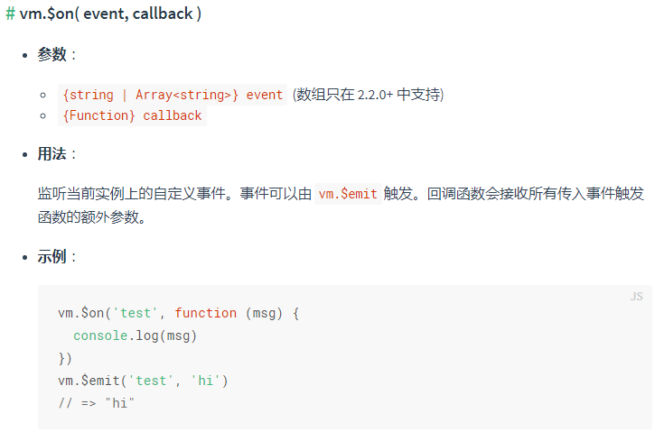

# vue-组件通信-eventBus

## 跨组件通信的`eventBus`通信的原理

```javascript
class EventBus {
    constructor() {
        this.event = Object.create(null);
    };
    // 注册事件
    on(name, fn) {
        if(!this.event[name]) {
            // 一个事件可能有多个监听者
            this.event[name] = [];
        };
        this.event[name].push(fn);
    };
    // 触发事件
    emit(name, ...args) {
        // 给回调函数传参
        this.event[name]&&this.event[name].forEach(fn => {
            fn(...args)
        });
    };
    // 只被触发一次的事件
    once(name, fn) {
        // 在这里同时完成了对该事件的注册、对该事件的触发，并在最后取消该事件。
        const cb = (...args) => {
            // 触发
            fn(...args);
            // 取消
            this.off(name,fn);
        };
        // 监听
        this.on(name,cb);
    };
    // 取消事件
    off(name, offcb) {
        if (this.event[name]) {
            let index = this.event[name].findIndex((fn) => {
                return offcb === fn;
            })
            this.event[name].splice(index,1);
            if (!this.event[name].length) {
                delete this.event[name];
            }
        }
    }
}
```

以上代码用的是发布订阅模式。

## 父子组件通信原则

为了提高组件的独立性和重用性，父组件会通过props向下传数据给子组件，当子组件通知父组件时用通过$emit事件告诉父组件，如此确保每个组件都是独立在相对隔离的环境中运行，可以大幅度提高组件的可维护性

单这套通信原则对于兄弟组件之间的数据通讯就有问题，在Vue中有其他的方式来处理兄弟组件之间的数据通讯，比如vuex这样的库，因为项目大小的问题，我们考虑Vue的事件总线，即`EventBus`

## EventBuS简介

EventBus又称中央事件总线，在Vue中可以使用EventBus来作为沟通桥梁的概念，就像是所有事件共用相同的事件中心，可以向该中心发送事件或接收事件，所有组件都可以上下平行的通知其他组件，但太方便若使用不慎，就会造成难以维护的灾难，因此才需要更完善的Vuex作为状态管理中心，将通知的概念上升到共享状态层次。

## 如何使用EventBus （一）

思路就是声明一个全局Vue实例变量 `EventBus` , 把所有的通信数据，事件监听都存储到这个变量上。这样就达到在组件间数据共享了，有点类似于 `Vuex`。但这种方式只适用于极小的项目，复杂项目还是推荐 Vuex。

### 初始化

首先你需要做的是创建事件总线并将其导出，以便其它模块可以使用或者监听它。新创建一个 `.js` 文件，比如 `eventBus.js` ：

```javascript
// eventBus.js
import Vue from 'vue'
export const EventBus = new Vue()
```

你需要做的只是引入 Vue 并导出它的一个实例（在这种情况下，称它为 `EventBus` ）。实质上**它是一个不具备 DOM 的组件，它具有的仅仅只是它实例方法而已，因此它非常的轻便**。

### 发送事件

假设你有两个子组件： `DecreaseCount` 和 `IncrementCount` ，分别在按钮中绑定了 `decrease()`和 `increment()` 方法。这两个方法做的事情很简单，就是数值递减（增）1 ，以及角度值递减（增）180。在这两个方法中，通过 `EventBus.$emit(channel: string, callback(payload1,…))` 监听 `decreased` （和 `incremented` ）频道。

```vue
<!-- DecreaseCount.vue子组件 -->
<template>
    <button @click="decrease()">-</button>
</template>
<script>
    import { EventBus } from "../eventBus.js";
    export default {
        name: "DecreaseCount",
        data() {
            return {
                num: 1,
                deg: 180
            }
        },
        methods: {
            decrease() {
                EventBus.$emit("decreased", {
                    num: this.num,
                    deg: this.deg
                })
            }
        }
    }; 
</script>
 
<!-- IncrementCount.vue子组件 -->
<template>
    <button @click="increment()">+</button>
</template>
<script>
    import { EventBus } from "../eventBus.js";
    export default {
        name: "IncrementCount",
        data() {
            return {
                num: 1,
                deg: 180
            }
        },
        methods: {
            increment() {
                EventBus.$emit("incremented", {
                    num: this.num,
                    deg: this.deg
                })
            }
        }
    }
 </script>
```

上面的示例，在 `DecreaseCount` 和 `IncrementCount` 分别发送出了 `decreased` 和 `incremented`频道。接下来，我们需要在另一个组件中接收这两个事件，保持数据在各组件之间的通讯。

### 接收事件

现在我们可以在组件 `App.vue` 中使用 `EventBus.$on(channel: string, callback(payload1,…))`监听 `DecreaseCount` 和 `IncrementCount` 分别发送出了 `decreased` 和 `incremented` 频道。

```vue
<!-- App.vue -->
<template>
    <div id="app">
        <div class="container" :style="{transform: 'rotateY(' + degValue + 'deg)'}">
            <div class="front">
                <div class="increment">
                    <IncrementCount />
                </div>
                <div class="show-front">{{ fontCount }}</div>
                <div class="decrement">
                    <DecreaseCount />
                </div>
            </div>
            <div class="back">
                <div class="increment">
                    <IncrementCount />
                </div>
                <div class="show-back">{{ backCount }}</div>
                <div class="decrement">
                    <DecreaseCount />
                </div>
            </div> 
        </div>
    </div>
</template>
 
<script>
    import IncrementCount from "./components/IncrementCount";
    import DecreaseCount from "./components/DecreaseCount";
    import { EventBus } from "./eventBus.js";
    export default {
        name: "App",
        components: {
            IncrementCount,
            DecreaseCount
        },
        data() {
            return {
                degValue: 0,
                fontCount: 0,
                backCount: 0
            }
        },
        mounted() {
            EventBus.$on("incremented", ({num, deg}) => {
                this.fontCount += num
                this.$nextTick(() => {
                    this.backCount += num
                    this.degValue += deg;
                })
            })
            EventBus.$on("decreased", ({num, deg}) => {
                this.fontCount -= num
                this.$nextTick(() => {
                    this.backCount -= num
                    this.degValue -= deg
                })
            })
        }
    }
</script>
```

### 移除事件监听者

如果想移除事件的监听，可以像下面这样操作：

```javascript
import { eventBus } from './eventBus.js'
EventBus.$off('decreased', {})
```

你也可以使用 `EventBus.$off(‘decreased’)` 来移除应用内所有对此事件的监听。或者直接调用`EventBus.$off()` 来移除所有事件频道， **注意不需要添加任何参数** 。

## 如何使用EventBus （二）



可以看到需要同一个vue实例来调用两个方法。所以可以建立一个中转站。

> 原理就是把 Vue 实例当作一个中转站。

首先，在任意位置新建`bus.js`文件。

```javascript
import Vue from 'vue'
export default new Vue
```


其次，在两个页面都引入它，注意引入路径。

```javascript
import Bus from '../bus.js';
```


然后，是调用方：

```javascript
methods: {
    functionA() {
        Bus.$emit('demo', 'msg');
    }
}
```


最后，是被调用方：

```javascript
mounted() {
  Bus.$on('demo', (msg) => {
    console.log(msg);
    this.functionB();
  })
},
methods: {
    functionB() {
        ...
    }
}
```

