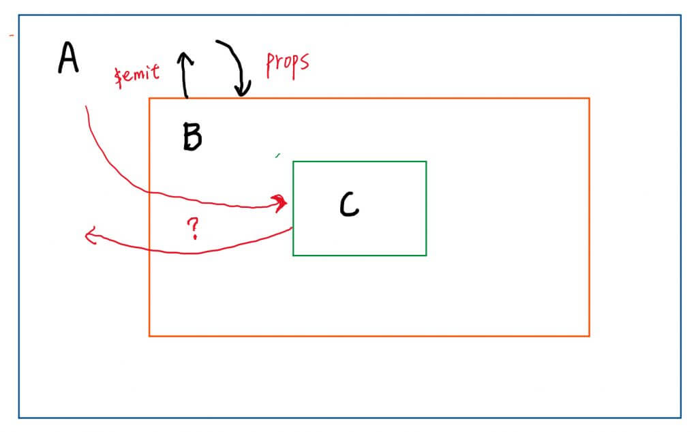

# vue inheritAttrs、attrs和attrs和listeners使用

inheritAttrs、attrs和attrs和listeners使用场景：

**组件传值**，尤其是**祖孙组件**有跨度的传值。



现在我们来讨论一种情况，A组件与C组件怎么通信，我们有多少种解决方案？

1. 我们使用VueX来进行数据管理，但是如果项目中**多个组件共享状态比较少**，项目比较小，并且全局状态比较少，那使用VueX来实现该功能，并没有发挥出**VueX**的威力。
2. 使用B来做中转站，当**A组件**需要把信息传给C组件时，B接受A组件的信息，然后利用属性传给**C组件，**这是一种解决方案，但是如果嵌套的组件过多，会导致代码繁琐，代码维护比较困难；**如果C中状态的改变需要传递给A, 使用事件系统一级级往上传递 。**
3. 自定义一个Vue 中央数据总线，这个情况适合碰到组件跨级传递消息，但是使用VueX感觉又有点浪费的项目中，但是缺点是**，碰到多人合作时，代码的维护性较低，代码可读性低**

在很多开发情况下，我们只是想把A组件的信息传递给C组件，如果使用props 绑定来进行信息的传递，虽然能够实现，但是代码并不美观。

在vue2.4中，为了解决该需求，引入了**$attrs** 和**$listeners ，** 新增了**inheritAttrs** 选项。 在版本2.4以前，默认情况下父作用域的不被认作props的属性属性，将会“回退”且作为普通的HTML特性应用在子组件的根元素上。如下列的例子

**inheritAttrs** 属性说明：<https://cn.vuejs.org/v2/api/#inheritAttrs>

说明比较晦涩。

组件传值一般是通过**props**传值的。inheritAttrs默认值为true，true的意思是将父组件中除了props外的属性添加到子组件的**根节点上(说明，即使设置为true，子组件仍然可以通过$attr获取到props意外的属性)**。示例代码：

> grandpaDom.vue：

```vue
<template>
   <div>
     <father-dom
      :foo="foo"
      :coo="foo"
      v-on:upRocket="reciveRocket"
     >
     </father-dom>
   </div>
</template>
<script>
   import fatherDom from "./fatherDom.vue";
   export default {
     data() {
        return {
          foo: "Hello, world",
          coo: "Hello, LSO"
        }
     },
     components:{fatherDom},
     methods:{
       reciveRocket(){
         console.log('火箭发射成功！');
       }
     }
   }
</script>
```

> fatherDom.vue：
>

```vue
<template>
   <div>
     <p>------------fatherDom-------------</p>
      <p>attrs:{{$attrs}}</p>
      <p>foo:{{foo}}</p>
      <p>------------fatherDom-------------</p>
      <child-dom v-bind="$attrs" v-on="$listeners"></child-dom>
   </div>
</template>
<script>
import childDom from "./childDom.vue";
export default {
	name:'father-dom',
	props:["foo"],
	components:{childDom},
}
</script>
```

说明：grandpaDom.vue将foo和coo属性都放在fatherDom.vue上，但是fatherDom.vue的props值接收了foo，因此grandpaDom的coo属性显示在了fatherDom的根节点上。即：


接着将`inheritAttrs:false`后（请将fatherDom.vue添加`inheritAttrs:false`），coo属性就不会显示在fatherDom根节点上了。但是怎么获**取到coo呢**？

这时就通过$**attrs**获取到到coo。

接着看孙组件childDom.vue:

```vue
<template>
  <div>
    <p>------------childDom-------------</p>
    <p>coo:{{coo}}</p>
    <button @click="startUpRocket">我要发射火箭</button>
    <p>------------childDom-------------</p>
  </div>
</template>
<script>
export default {
  name: "childDom",
  props: ["coo"],
  methods: {
    startUpRocket() {
      this.$emit("upRocket");
      console.log('我要发射火箭了。');
    }
  }
};
</script>
```

孙组件childDom.vue就可以通过**props**接收到coo属性了。

好，以上是**祖父--父亲--儿子向下传递值**。

那怎么**儿子-父亲--祖父传递数据**呢？

父亲组件使用**$listeners**传递。


最终祖父组件收到孙组件的事件了。

