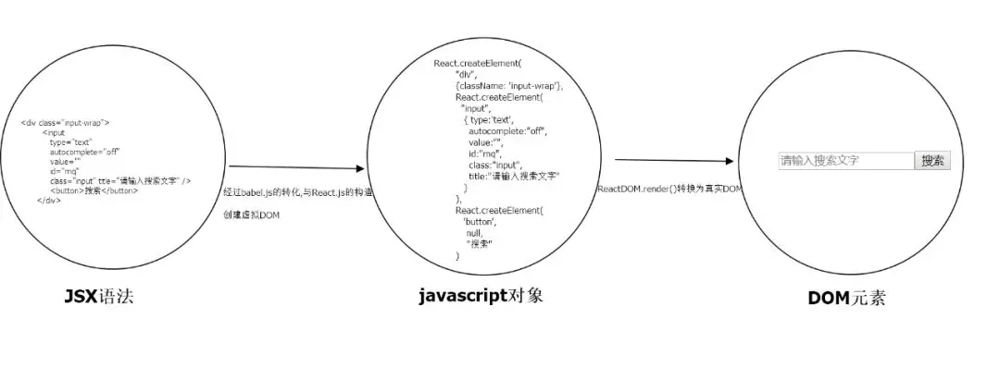

# react jsx

> ### JSX是什么?

**全称**: JavaScript and XML

**定义**: 可拓展(自定义)标记性语言，基于 JavaScript，融入了 XML，我们可以在 js 中书写 xml，使用 JSX 可以很好的描述 UI 在页面中应该呈现它应有的交互形式

**注意**:

- React 中并没有模板语言（类似 Vue 的 template 的），但是它具有JavaScript的全部的功能
- 可以在 JS 中书写 XML（HTML） **只能有且仅有一个顶层元素**，当然也**可以借助 React 提供的Fragment(也叫占位符)这个内置组件将你写的 JSX 子元素给包裹起来**，可以包含子节点，也支持插值表达式 {表达式}
- 为了便于阅读，**return 返回的 jsx 内容，用一个圆括号()包裹起来，这样可以将 JSX 拆分为多行**。这样做不是强制要求的，但是这可以避免遇到自动插入分号陷阱

如下所示:

```jsx
import React from "react";
import ReactDOM from "react-dom";

class Acomponent extends React.Component {
    render() {
        // return 后面带着一个圆括号，只是为了换行显示，根节点最顶层只能是一个元素
        return (
            <div>
                <h1 title="我是LSO">一个靠前排的90后帅小伙</h1>
                <h2>欢迎关注MusicTen</h2>
            </div>
        )
    }
}

// 或者使用React提供的Fragement占位符组件也可以，但是先引入
import React, { Componnet, Fragment } from "react";
import ReactDOM from "react-dom";

class Acomponent extends Component {
    render() {
        return (
            <Fragment>
                <h1 title="我是LSO">一个靠前排的90后帅小伙</h1>
                <h2>欢迎关注MusicTen</h2>
            </Fragment>
        )
    }
}
```

**使用 React 一定要引入 React 库，引入这个是为了解析识别 JSX 语法糖（React.createElement()函数的替代）；当然另一方面也是为了创建虚拟 DOM。**

> 经过babel编译，**Babel 会把 JSX 转译成一个名为 React.createElement() 函数调用**

**引入 react-dom 是为了渲染组件，将组件挂载到特定的位置上，同时将虚拟 DOM 转换为真实 DOM，插入到页面中**

