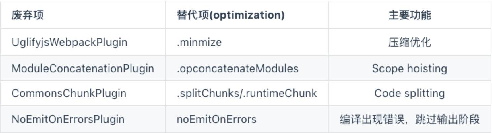
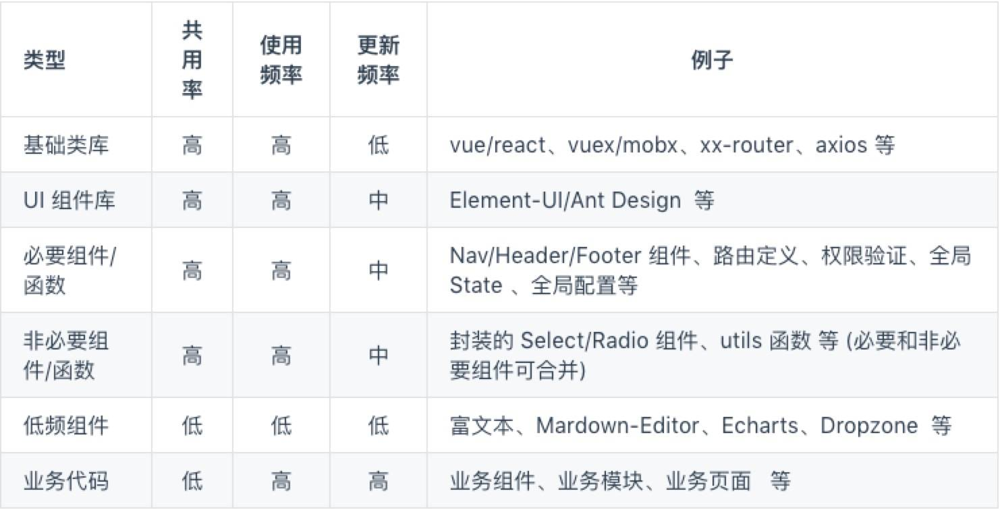

# 手摸手使用 webpack4

## 带来的变化

其实这次升级带来了不少改变，但大部分其实对于普通用户来说是不需要关注的，比如这次升级带来的功能`SideEffects`、`Module Type’s Introduced`、`WebAssembly Support`，基本平时是用不到的。我们主要关注那些对我们影响比较大的改动如：`optimization.splitChunks`代替原有的`CommonsChunkPlugin`，和`Better Defaults-mode`更好的默认配置，这是大家稍微需要关注一下的。



## 默认配置

webpack 4 引入了`零配置`的概念，被 [parcel](https://link.juejin.im/?target=https%3A%2F%2Fgithub.com%2Fparcel-bundler%2Fparcel) 刺激到了。 不管效果怎样，这改变还是值得称赞的。

## **webpack中的三个概念module、chunk和bundle**

在研究`splitChunks`之前，我们必须先弄明白这三个名词是什么意思，主要是chunk的含义，要不然你就不知道`splitChunks`是在什么的基础上进行拆分。

从官网上貌似没找太多的解释，去网上搜了搜基本上都在转述这位老哥的回答[《what are module,chunk and bundle in webpack》](https://stackoverflow.com/questions/42523436/what-are-module-chunk-and-bundle-in-webpack)，我根据自己的理解给出我个人的看法：

- module：就是js的模块化webpack支持commonJS、ES6等模块化规范，简单来说就是你通过import语句引入的代码。
- chunk: chunk是webpack根据功能拆分出来的，包含三种情况：

　　　　1、你的项目入口（entry）

　　　　2、通过import()动态引入的代码

　　　　3、通过splitChunks拆分出来的代码

　　　　chunk包含着module，可能是一对多也可能是一对一。

- bundle：bundle是webpack打包之后的各个文件，一般就是和chunk是一对一的关系，bundle就是对chunk进行编译压缩打包等处理之后的产出。

## 默认分包策略

webpack 4 最大的改动就是废除了 `CommonsChunkPlugin` 引入了 `optimization.splitChunks`。

webpack 4 的`Code Splitting`（代码拆分） 它最大的特点就是配置简单，如果你的 `mode` 是 `production`，那么 webpack 4 就会自动开启 `Code Splitting`。

在没配置任何东西的情况下，webpack 4 就智能的帮你做了代码分包。入口文件依赖的文件都被打包进了`app.js`

```javascript
module.exports = {
  //...
  optimization: {
    splitChunks: {
      chunks: 'async',
      minSize: 30000,
      minChunks: 1,
      maxAsyncRequests: 5,
      maxInitialRequests: 3,
      automaticNameDelimiter: '~',
      name: true,
      cacheGroups: {
        vendors: {
          test: /[\\/]node_modules[\\/]/,
          priority: -10
        },
        default: {
          minChunks: 2,
          priority: -20,
          reuseExistingChunk: true
        }
      }
    }
  }
}
```

它内置的代码分割策略是这样的：

- 新的 chunk 是否被共享或者是来自 node_modules 的模块
- 新的 chunk 体积在压缩之前是否大于 30kb
- 按需加载 chunk 的并发请求数量小于等于 5 个
- 页面初始加载时的并发请求数量小于等于 3 个

你可能会觉得 webpack 默认策略是不是有问题，我一个组件被多个页面，你每个页面都将这个组件打包进去了，岂不是会重复打包很多次这个组件？就拿`vue-count-to`来举例，你可以把共用`两次以上`的组件或者代码单独抽出来打包成一个 bundle，但你不要忘了`vue-count-to`未压缩的情况下就只有 5kb，gizp 压缩完可能只有 1.5kb 左右，你为了共用这 1.5kb 的代码，却要额外花费一次 http 请求的时间损耗，得不偿失。所以 webpack 目前默认的打包规则是一个比较合理的策略了。

但有些场景下这些规则可能就显得不怎么合理了。比如我有一个管理后台，它大部分的页面都是表单和 Table，我使用了一个第三方 table 组件，几乎后台每个页面都需要它，但它的体积也就 15kb，不具备单独拆包的标准，它就这样被打包到每个页面的 bundle 中了，这就很浪费资源了。这种情况下建议把大部分页面能共用的组件单独抽出来，合并成一个`component-vendor.js`的包。

不同的业务，优化的侧重点是不同的。个人认为 webpack 4 默认拆包已经做得不错了，对于大部分简单的应用来说已经够用了。但作为一个通用打包工具，它是不可能满足所有的业务形态和场景的，所以接下来就需要我们自己稍微做一些优化了。

## 优化分包策略

就拿 [vue-element-admin](https://link.juejin.im?target=https%3A%2F%2Fgithub.com%2FPanJiaChen%2Fvue-element-admin) 来说，它是一个基于 [Element-UI](https://link.juejin.im?target=https%3A%2F%2Fgithub.com%2FElemeFE%2Felement) 的管理后台，所以它会用到如 `echarts`、`xlsx`、`dropzone`等各种第三方插件，同时又由于是管理后台，所以本身自己也会写很多共用组件，比如各种封装好的搜索查询组件，共用的业务模块等等，如果按照默认的拆包规则，结果就不怎么完美了。

我们现在的策略是按照体积大小、共用率、更新频率重新划分我们的包，使其尽可能的利用浏览器缓存。



## Long term caching

持久化缓存其实是一个老生常谈的问题，前端发展到现在，缓存方案已经很成熟了。简单原理：

- 针对 html 文件：不开启缓存，把 html 放到自己的服务器上，关闭服务器的缓存
- 针对静态的 js，css，图片等文件：开启 cdn 和缓存，将静态资源上传到 cdn 服务商，我们可以对资源开启长期缓存，因为每个资源的路径都是独一无二的，所以不会导致资源被覆盖，保证线上用户访问的稳定性。
- 每次发布更新的时候，先将静态资源(js, css, img) 传到 cdn 服务上，然后再上传 html 文件，这样既保证了老用户能否正常访问，又能让新用户看到新的页面。

## 展望

[Whats next?](https://link.juejin.im?target=https%3A%2F%2Fmedium.com%2Fwebpack%2Fwebpack-4-released-today-6cdb994702d4) 官方在这篇文章中展望了一下 webpack5 和讲述了一下未来的计划--持续改进用户体验、提升构建速度和性能，降低使用门槛，完善`Persistent Caching`等等。同时 webpack 也已经支持 `Prefetching/Preloading modules`，相信之后也会有更多的网站会使用这一属性。

同时 webpack 的团队已经承诺会通过投票的方式来决定一些功能。

最后还是期待一下 webpack5 和它之后的发展吧。如果没有 webpack，也就不会有今天的前端。

其实如一开始就讲的，vue 有`vue-cli`、react 有`creat-react-app`，现在新建项目基本都是基于脚手架的，很少有人从零开始写 webpack 配置文件的，而且一般开发中，一般程序员也不需要经常去修改 webpack 的配置。webpack 官方本身也在不断完善默认配置项，相信 webpack 的配置门槛也会越来低多。

**愿世间再无 webpack 配置工程师。**

