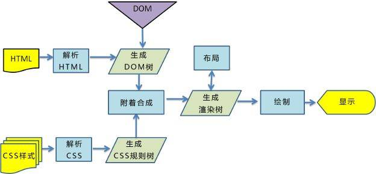
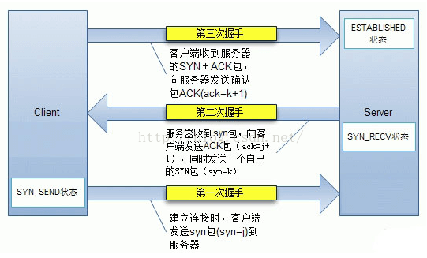
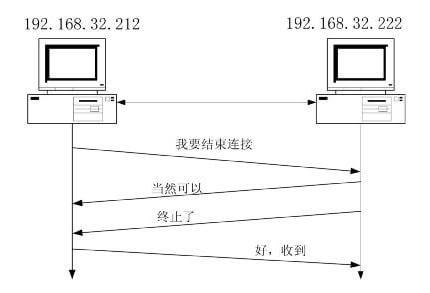
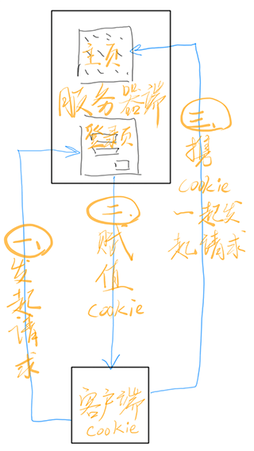
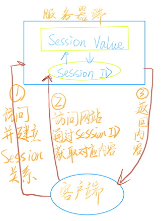

# HTTP 常见知识点复习

### 前言

📅推荐一个 github 仓库 —— [《awesome-http》](https://github.com/semlinker/awesome-http)，内容挺棒的。

### 1. 浏览器输入 URL 地址后发生的事情

#### 1.1 描述

- 用户输入url
- 浏览器查找域名的 IP 地址 域名解析(DNS解析)
- 找到 IP 地址后，建立 TCP 三次握手，与目标服务器建立连接
- 握手成功后，通过HTTP/HTTPS协议，浏览器向服务器发送 HTTP请求（请求报文）
- 服务器处理收到的请求，将响应报文返回至浏览器
- 浏览器收到 HTTP 响应报文，关闭连接
- 浏览器解析文档 开始渲染：
  - 处理 HTML 并构建 DOM 树
  - 处理 CSS 构建 CSS 规则树
  - 将 DOM 树 与 CSS 规则树 合并成一个渲染树
  - 根据渲染树来布局，计算每个节点的位置
  - 调用 GPU 绘制，合成图层，显示在屏幕上

#### 1.2 TCP 知识点补充

建立 TCP 需要三次握手才能建立，而断开连接则需要四次挥手。

**TCP三次握手**：

所谓的三次握手，是指建立一个 TCP 连接时，需要客户端和服务器端总共发送三个包，三次握手的目的是连接服务器的指定端口，建立 TCP 连接，并同步连接双方的序列号和确认号并交换 TCP 窗口大小信息，在 SOCKET 编程中，客户端执行 connect() 时，将会触发三次握手：

**TCP四次挥手：**

TCP连接的拆除需要发送四个包，客户端或者服务器端均可主动发起挥手动作，在SOCKET编程中，任何一方执行close()即可产生挥手操作。

### 2. 请介绍常见的 HTTP 状态码(至少五个)

状态码是由 3 位数组成，第一个数字定义了响应的类别，且有五种可能取值：

**1xx：**指示信息–表示请求已接收，继续处理。

- 100 客户必须继续发出请求
- 101 客户要求服务器根据请求转换HTTP协议版本

**2xx：**成功–表示请求已被成功接收、理解、接受。

- 200 （成功） 服务器已成功处理了请求。 通常，这表示服务器提供了请求的网页。
- 201 （已创建） 请求成功并且服务器创建了新的资源。
- 202 （已接受） 服务器已接受请求，但尚未处理。

**3xx：**重定向–要完成请求必须进行更进一步的操作。

- 300 （多种选择） 针对请求，服务器可执行多种操作。 服务器可根据请求者 (user agent) 选择一项操作，或提供操作列表供请求者选择。
- 301 （永久移动） 请求的网页已永久移动到新位置。 服务器返回此响应（对 GET 或 HEAD 请求的响应）时，会自动将请求者转到新位置。
- 302 （临时移动） 服务器目前从不同位置的网页响应请求，但请求者应继续使用原有位置来进行以后的请求。

**4xx：**客户端错误–请求有语法错误或请求无法实现。

- 400 （错误请求） 服务器不理解请求的语法。
- 401 （未授权） 请求要求身份验证。 对于需要登录的网页，服务器可能返回此响应。
- 403 （禁止） 服务器拒绝请求。

**5xx：**服务器端错误–服务器未能实现合法的请求。

- 500 （服务器内部错误） 服务器遇到错误，无法完成请求。
- 501 （尚未实施） 服务器不具备完成请求的功能。 例如，服务器无法识别请求方法时可能返回此代码。
- 502 （错误网关） 服务器作为网关或代理，从上游服务器收到无效响应。
- 503 （服务不可用） 服务器目前无法使用（由于超载或停机维护）。 通常，这只是暂时状态。
- 504 （网关超时） 服务器作为网关或代理，但是没有及时从上游服务器收到请求。
- 505 （HTTP 版本不受支持） 服务器不支持请求中所用的 HTTP 协议版本。

### 3. 请介绍常见的 HTTP 头部(至少五个)

#### 3.1 HTTP 头部

更多完整内容，可以查看 《HTTP响应头和请求头信息对照表》

| 首部字段名          | 说明                                                         |
| :------------------ | :----------------------------------------------------------- |
| `Accept`            | 告诉服务器，客户端支持的数据类型。                           |
| `Accept-Charset`    | 告诉服务器，客户端采用的编码。                               |
| `Accept-Encoding`   | 告诉服务器，客户机支持的数据压缩格式。                       |
| `Accept-Language`   | 告诉服务器，客户机的语言环境。                               |
| `Host`              | 客户机通过这个头告诉服务器，想访问的主机名。                 |
| `If-Modified-Since` | 客户机通过这个头告诉服务器，资源的缓存时间。                 |
| `Referer`           | 客户机通过这个头告诉服务器，它是从哪个资源来访问服务器的。（一般用于防盗链） |
| `User-Agent`        | 客户机通过这个头告诉服务器，客户机的软件环境。               |
| `Cookie`            | 客户机通过这个头告诉服务器，可以向服务器带数据。             |
| `Connection`        | 客户机通过这个头告诉服务器，请求完后是关闭还是保持链接。     |
| `Date`              | 客户机通过这个头告诉服务器，客户机当前请求时间               |

#### 3.2 Request Header

举例：

| Request Header                                               | 描述                                                         |
| :----------------------------------------------------------- | :----------------------------------------------------------- |
| `GET /sample.Jsp HTTP/1.1`                                   | 请求行                                                       |
| `Host: www.uuid.online/`                                     | 请求的目标域名和端口号                                       |
| `Origin: http://localhost:8081/`                             | 请求的来源域名和端口号 （跨域请求时，浏览器会自动带上这个头信息） |
| `Referer: https:/localhost:8081/link?query=xxxxx`            | 请求资源的完整URI                                            |
| `User-Agent: Mozilla/5.0 (Windows NT 10.0; Win64; x64) AppleWebKit/537.36 (KHTML, like Gecko) Chrome/67.0.3396.99 Safari/537.36` | 浏览器信息                                                   |
| `Cookie: BAIDUID=FA89F036:FG=1; BD_HOME=1; sugstore=0`       | 当前域名下的Cookie                                           |
| `Accept: text/html,image/apng`                               | 代表客户端希望接受的数据类型是html或者是png图片类型          |
| `Accept-Encoding: gzip, deflate`                             | 代表客户端能支持 gzip 和 deflate 格式的压缩                  |
| `Accept-Language: zh-CN,zh;q=0.9`                            | 代表客户端可以支持语言 zh-CN 或者 zh (值得一提的是q(0~1)是优先级权重的意思，不写默认为1，这里 zh-CN 是1， zh 是0.9) |
| `Connection: keep-alive`                                     | 告诉服务器，客户端需要的 tcp 连接是一个长连接                |

#### 3.3 Response Header

举例：

| Response Header |描述|
|---|---|
|`HTTP/1.1 200 OK`| 响应状态行|
|`Date: Mon, 30 Jul 2018 02:50:55 GMT`|服务端发送资源时的服务器时间|
|`Expires: Wed, 31 Dec 1969 23:59:59 GMT`|较过时的一种验证缓存的方式，与浏览器（客户端）的时间比较，超过这个时间就不用缓存（不和服务器进行验证），适合版本比较稳定的网页|
### 4. 常用的 HTTP 方法，和 GET / POST 请求

#### 4.1 HTTP Request Method

HTTP1.0 定义了三种请求方法： GET、POST 和 HEAD方法。 

HTTP/1.1 新增了五种请求方法：OPTIONS、PUT、DELETE、TRACE 和 CONNECT 方法。

| 序号 | 方法    | 描述                                                         |
| :--- | :------ | :----------------------------------------------------------- |
| 1    | GET     | 请求指定的页面信息，并返回实体主体。                         |
| 2    | HEAD    | 类似于get请求，只不过返回的响应中没有具体的内容，用于获取报头 |
| 3    | POST    | 向指定资源提交数据进行处理请求（例如提交表单或者上传文件）。数据被包含在请求体中。POST请求可能会导致新的资源的建立和/或已有资源的修改。 |
| 4    | PUT     | 从客户端向服务器传送的数据取代指定的文档的内容。             |
| 5    | DELETE  | 请求服务器删除指定的页面。                                   |
| 6    | CONNECT | HTTP/1.1协议中预留给能够将连接改为管道方式的代理服务器。     |
| 7    | OPTIONS | 允许客户端查看服务器的性能。（预请求走此协议）               |
| 8    | TRACE   | 回显服务器收到的请求，主要用于测试或诊断。                   |
| 9    | PATCH   | 实体中包含一个表，表中说明与该URI所表示的原内容的区别。      |

#### 4.2 GET 与 POST 请求之间的区别

| 区别内容                  | GET                                                          | POST                                                         |
| :------------------------ | :----------------------------------------------------------- | :----------------------------------------------------------- |
| 点击返回/刷新按钮         | 没有影响                                                     | 数据会重新发送（浏览器将会提示“数据被重新提交”）             |
| 添加书签                  | 可以                                                         | 不可以                                                       |
| 缓存                      | 可以                                                         | 不可以                                                       |
| 编码类型（Encoding type） | `application/x-www-form-rulencoded`                          | `application/x-www-form-rulencoded` or `multipart/form-data` 请为二进制数据使用 `multipart` 编码 |
| 历史记录                  | 有                                                           | 没有                                                         |
| 长度限制                  | 有                                                           | 没有                                                         |
| 数据类型限制              | 只允许 ASCLll 字符类型                                       | 没有限制，允许二进制数据                                     |
| 安全性                    | 查询字符串会显示在地址栏的 URL 上，不安全，**请不要使用 GET 请求提交敏感数据** | 因为数据不会显示在地址栏中，也不会缓存下来或保存在浏览记录中，所以 POST 请求比 GET 请求安全，但也不是最安全的方式，如需要传送敏感数据，**请使用数据加密**。 |
| 可见性                    | 查询字符串在地址栏的 URL 中可见                              | 查询字符串在地址栏的 URL 中不可见                            |

### 5. Cookie 和 Session

#### 5.1 Cookie 

Cookie是存储在用户本地计算机上，用于保存一些用户操作的历史信息，当用户再次访问我们的服务器的时候，浏览器通过HTTP协议，将他们本地的Cookie内容也发到服务器上，从而完成验证。

- `Cookie` 是存储在浏览器客户的一小片数据；
- `Cookie` 可以同时被前台与后台操作；
- `Cookie` 可以跨页面存取；
- `Cookie` 是不可以跨服务器访问的；
- `Cookie` 有限制； 每个浏览器存储的个数不能超过300个，每个服务器不能超过20个，数据量不能超过4K；
- `Cookie` 是有生命周期的，默认与浏览器相同，如果进程退出，cookie会被销毁。

#### 5.2 Session

Session 存储在我们的服务器上，就是在我们的服务器上保存用户的操作信息。

当用户访问我们的网站时，我们的服务器会成一个 `Session ID`，然后把 `Session ID` 存储起来，再把这个 `Session ID `发给我们的用户，用户再次访问我们的服务器的时候，拿着这个 `Session ID就 `能验证了，当这个ID能与我们服务器上存储的ID对应起来时，我们就可以认为是自己人。

- `seesion` 数据存储在服务器端；
- 每一个会话分配一个单独的 `session_id`；
- 该 `session_id` 通过 `cookie` 传送到前台，默认的 `session_id` 名称是`PHPSESSIONID`;
- 前台只能看到 `Session` 的 `ID`，而不能修改 `Session` 值；
- 使用 `Session `之前需要先开启会话；
- `Session `存储在 `Session `数组 `$_SESSION `；
- `Session `存储方式比较安全，但是如果 `Session `数量过多，会导致服务器性能下降。

#### 5.3 两者区别

|        | Cookie                                               | session                                                      |
| :----- | :--------------------------------------------------- | :----------------------------------------------------------- |
| 定义   | 浏览器保存用户信息的文件，存储的数量和字符数都有限制 | 服务器把`sessionID` 和用户信息、用户操作，记录在服务器上，这些记录就称为`session` |
| 相同点 | 都是为了存储用户相关的信息                           |                                                              |
| 存储   | 客户端                                               | 服务器                                                       |
| 安全性 | 安全性不高，任何人都能直接查看                       | 安全性高                                                     |

#### 5.4 两者结合使用

- 存储在服务端：通过 `cookie `存储一个 `session_id `，然后具体的数据则是保存在 `session `中。如果用户已经登录，则服务器会在 `cookie `中保存一个 `session_id `，下次再次请求的时候，会把该 `session_id `携带上来，服务器根据 `session_id `在 `session `库中获取用户的 `session `数据。就能知道该用户到底是谁，以及之前保存的一些状态信息。这种专业术语叫做 `server side session `。
- 将 `session `数据加密，然后存储在 `cookie `中。这种专业术语叫做 `client side session `。

### 6. 请求报文与响应报文

请求报文由**请求行**、**请求头和**请求正文**组成

> 请求正文一般使用在 `POST` 方法中， `GET` 方法不存在请求正文。
>

响应报文由**状态行**、**响应头**和**响应正文**组成

### 7. HTTP/1.1 优缺点

**HTTP/1.1 缺点**

1. 队头阻塞

   此版本的网络延迟问题主要由于队头堵塞导致，虽然通过持久性连接得到改善，但是每一个请求的响应依然需要按照顺序排队，如果前面的响应处理较为耗费时间，那么同样非常耗费性能。

2. 技术不成熟

   虽然引进了管道机制，但是当前存在诸多问题，且默认处于关闭状态。

3. 浪费资源

   http/1.1 请求会携带大量冗余的头信息，浪费了很多宽带资源。

### 8. HTTP/2.0 有哪些新特性

- 二进制传输：将所有传输的信息分割为更小的消息和帧，并对它们采用二进制格式的编码

- 多路复用：一个 TCP 连接中可以发送多个请求
- Header 压缩
- 服务器推送：服务器可以额外的向客户端推送资源，而无需客户端明确的请求

### 9. 简述 HTTPS

**HTTPS 简介**

HTTPS 并非是应用层的一种新协议。只是 HTTP 通信接口部分用 SSL(Secure Socket Layer)和 TLS(Transport Layer Security)协议代替而已。

通常，HTTP 直接和 TCP 通信。当使用 SSL 时，则演变成先和 SSL 通信，再由 SSL 和 TCP 通信了。

简言之，所谓 HTTPS，其实就是身披 SSL 协议这层外壳的 HTTP。

> HTTPS 协议的主要功能基本都依赖于 TLS/SSL 协议，TLS/SSL 的功能实现主要依赖于三类基本算法：**散列函数** 、**对称加密**和**非对称加密**，其利用非对称加密实现身份认证和密钥协商，对称加密算法采用协商的密钥对数据加密，基于散列函数验证信息的完整性。
>

### 10. HTTP 和 HTTPS 的共同点和区别

1. HTTPS 协议需要到 ca 申请证书，一般免费证书较少，因而需要一定费用。
2. HTTP 信息是明文传输， HTTPS 则是具有安全性的ssl加密传输。
3. HTTPS 和 HTTPS 用的端口不一样，前者是80，后者是443。
4. http 的连接很简单，是无状态的； HTTPS 协议是由 SSL+HTTP 协议构建的可进行加密传输、身份认证的网络协议，比 http 协议安全。

### 11. 跨域问题

#### 11.1 什么是跨域

跨域使浏览器不能执行其他网站的脚本。它是由**浏览器的同源策略**造成的，是浏览器对JavaScript的限制。

- **什么是同源策略？**

同源策略（SOP， Same origin policy）是一种约定，由网景（Netscape）公司1995年引入浏览器，它是浏览器最核心也最基本的安全功能，如果缺少了同源策略，浏览器很容易受到 XSS 、 CSFR 等攻击。

> XSS
>
> - 基本概念：XSS（Cross-site scripting），也称跨域脚本攻击
> - 如何攻击：向页面注入恶意的标签或 js 代码来攻击网站。
> - 如何防御：让恶意插入的标签或js代码不可执行，如转义输入输出的内容

> CSRF
>
> - 基本概念：CSRF（Cross-site request forgery），也称跨站请求伪造forgery
> - 如何攻击：利用用户的登录态发起恶意请求。
> - 如何防御： 
>   - Get 请求不对数据进行修改
>   - 不让第三方网站访问到用户 Cookie
>   - 阻止第三方网站请求接口
>   - 请求时附带验证信息，比如验证码或者 token

> 所谓的同源是指：**域名**、**协议**、**端口**均为相同。

- **同源策略**限制了以下行为：

1. `Cookie`、`LocalStorage` 和 `IndexDB` 无法读取
2. `DOM` 和 `JS `对象无法获取
3. `Ajax`请求发送不出去

#### 11.2 解决跨域

1. `jsonp` 跨域（只支持GET）

2. `CORS`跨域资源共享（支持所有类型的HTTP请求）

    服务端设置 `Access-Control-Allow-Origin` 就可以开启 CORS。 该属性表示哪些域名可以访问资源，如果设置通配符则表示所有网站都可以访问资源

3. `postMessage` 跨域（HTML5）

   如窗口 A（http:A.com）向跨域的窗口 B（http:B.com）发送信息

4. `document.domain` /`window.name` /`location.hash` + `iframe` 跨域

   document.domain —— 只适用于二级域名相同的情况，如`a.test.com`和`b.test.com`，只需要给页面添加 `document.domain = 'test.com'` 表示二级域名都相同就可以实现跨域

   Hash：url 地址中 '#' 后面的部分，hash 的改变页面不会刷新。使用场景：当页面A通过iframe或frame嵌入了跨域的页面B

5. `nginx` 代理跨域（反向代理）

6. `withCredentials` 属性（IE11开始支持）

7. `WebSocket` 协议跨域（HTML5，支持 浏览器与服务器全双工通信，同时允许跨域通讯）

8. `nodeJS` 代理跨域

### 12. HTTP 中与缓存相关的请求头部

| 头部            | 优势和特点                                                   | 劣势和问题                                                   |
| :-------------- | :----------------------------------------------------------- | :----------------------------------------------------------- |
| `Expires`       | 1、`HTTP 1.0` 产物，可在`HTTP 1.0/1.1`中使用。 2、以时刻标识失效时间。 | 1、时间是由服务器发送的(`UTC`)。 2、存在版本问题，到期之前的修改客户端是不可知的。 |
| `Cache-Control` | 1、`HTTP 1.1` 产物，以时间间隔标识失效时间，解决了`Expires`服务器和客户端相对时间的问题。 2、比`Expires`多了很多选项设置。 | 1、不适用于`HTTP 1.0` 。 2、存在版本问题，到期之前的修改客户端是不可知的。 |
| `Last-Modified` | 1、不存在版本问题，每次请求都会去服务器进行校验。服务器对比最后修改时间如果相同则返回304，不同返回200以及资源内容。 | 1、只要资源修改，无论内容是否发生实质性的变化，都会将该资源返回客户端。例如周期性重写，这种情况下该资源包含的数据实际上一样的。 2、以时刻作为标识，无法识别一秒内进行多次修改的情况。 3、某些服务器不能精确的得到文件的最后修改时间。 |
| `ETag`          | 1、可以更加精确的判断资源是否被修改，可以识别一秒内多次修改的情况。2、不存在版本问题，每次请求都回去服务器进行校验。 | 1、计算`ETag`值需要性能损耗。 2、分布式服务器存储的情况下，计算`ETag`的算法如果不一样，会导致浏览器从一台服务器上获得页面内容后到另外一台服务器上进行验证时发现`ETag`不匹配的情况。 |

### 13. 介绍强缓存和协商缓存

缓存的原理：将请求来的资源存放到本地磁盘当中，下次获取资源则直接在磁盘当中读取而不再去向服务器发送请求。

主要分为**强缓存**（也称本地缓存）和**协商缓存**（也称弱缓存）。

#### 13.1 强缓存

**强缓存**是通过两种响应头： `Expires` 和 `Cache-Control` 两个字段来控制的，用来表示资源的缓存时间。

> `Expires: Wed, 22 Oct 2018 08:41:00 GMT` // Expires 是 HTTP / 1.0 的产物，表示资源会在 Wed, 22 Oct 2018 08:41:00 GMT 后过期，需要再次请求。 // 并且 Expires 受限于本地时间，如果修改了本地时间，可能会造成缓存失效。
>
> `Cache-control: max-age=30` // Cache-Control 出现于 HTTP / 1.1，优先级高于 Expires 。该属性表示资源会在 30 秒后过期，需要再次请求。

#### 13.2 协商缓存

**协商缓存**就是由服务器来确定缓存资源是否可用，所以客户端与服务器端要通过某种标识来进行通信，从而让服务器判断请求资源是否可以缓存访问。

普通刷新会启用弱缓存，忽略强缓存。只有在地址栏或收藏夹输入网址、通过链接引用资源等情况下，浏览器才会启用强缓存，这也是为什么有时候我们更新一张图片、一个js文件，页面内容依然是旧的，但是直接浏览器访问那个图片/文件，看到的内容却是新的。

这个主要涉及到两组 `header` 字段： `Etag` 和 `If-None-Match `、 `Last-Modified `和 `If-Modified-Since `。

向服务器发送请求，服务器会根据这个请求的request header的一些参数来判断是否命中协商缓存。

### 结语

这里主要复习了 HTTP/HTTPS 的一些基础知识，还有 HTTP 的其他版本的知识，对于面试也好，知识沉淀也好，这些也是我们作为开发者必须懂的。作为一名前端开发者，说实话对 HTTP/HTTPS 了解还是太少。
